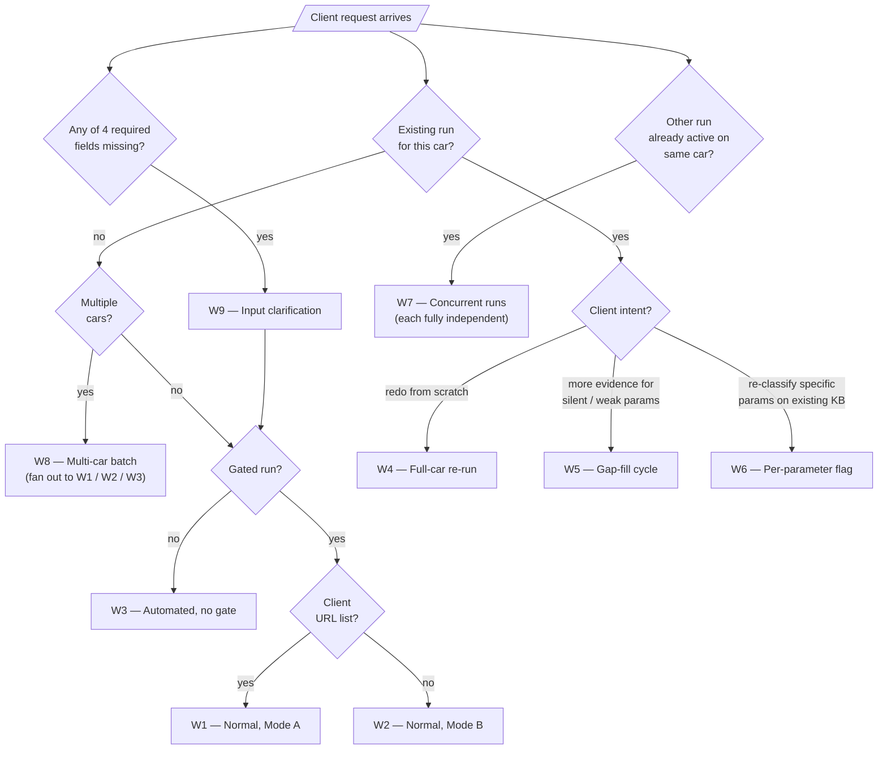

# 13 — Potential Workflows

This document enumerates every distinct workflow that can be invoked against the skill. Each workflow is a sequence of the stages defined in `12-workflow-diagram.md`, composed differently depending on client intent. Workflows share building blocks but are **independently triggered** — they are never silently chained by the agent.

The goal of this document is to make explicit which workflows the skill must support, so that the workflow-design phase can specify each one individually without re-deriving them.

***

## Workflow catalogue (summary)

| #  | Name                             | Trigger                                      | Approval gate | Scope                | New KB?      | New run ID? |
| :- | :------------------------------- | :------------------------------------------- | :------------ | :------------------- | :----------- | :---------- |
| W1 | Normal pipeline — Mode A         | Client submits request + URL list            | Yes           | Full car, all params | Yes          | Yes         |
| W2 | Normal pipeline — Mode B         | Client submits request, no URLs              | Yes           | Full car, all params | Yes          | Yes         |
| W3 | Automated mode (no gate)         | Client flags run as "automated"              | **No**        | Full car, all params | Yes          | Yes         |
| W4 | Full-car re-run                  | Client requests full redo                    | Yes           | Full car, all params | Yes          | Yes         |
| W5 | Gap-fill cycle (coverage-driven) | Client triggers after review                 | Optional      | Targeted params only | **Reuse**    | No (same)   |
| W6 | Per-parameter flagging re-run    | Client marks specific params                 | Optional      | Flagged params only  | Reuse or new | Depends     |
| W7 | Concurrent runs on same car      | Client initiates 2+ independent W1/W2        | Yes (each)    | Full car × N         | Yes (each)   | Yes (each)  |
| W8 | Multi-car batch                  | Client submits N cars                        | Yes (each)    | One car per sub-run  | Yes (each)   | Yes (each)  |
| W9 | Input clarification sub-workflow | Triggered inline when required field missing | —             | Pre-pipeline         | —            | —           |

***

## W1 — Normal pipeline, Mode A (client supplies URLs)

**Preconditions:** client provides a brand, model, year, market, and at least one URL.

**Stages:**

1. Parse request, extract four required fields (prompt via W9 if any missing).
2. Resolve car identity (auto-select most prominent variant if ambiguous).
3. Load `artifacts/params.csv` into run workspace (frozen).
4. Accept client-supplied URLs. Canonicalise + dedupe. Paywall-filter. No cap on Mode A URLs.
5. Flag each URL for approval with metadata (title, excerpt, why-selected, car identity, run ID).
6. Agent yields — approval gate open.
7. Client approves / rejects via approval-store UI and sends "resume" signal.
8. Retrieve-approved. Download (3 retries, backoff). Upload to fresh RAGFlow dataset.
9. Poll `doc_infos` until all docs ingested (or 60-min per-doc timeout → drop).
10. Spawn sub-agents partitioned by category.
11. Each sub-agent queries shared KB per parameter; emits Presence / Status / Classification + traceability blocks.
12. Orchestrator merges sub-agent outputs. Writes `.harness/` artefacts.
13. Emit `deliverable.json` + `deliverable.csv` into run workspace. Notify client.

**Exit conditions:** deliverable emitted, workspace sealed, KB archived.

**Notes:** Mode A URLs are uncapped and tagged `origin = client`. If the client's URL list is empty after paywall-filter, the agent proceeds with zero URLs and W1 collapses into Rule-4 everywhere (every parameter: silent-all).

***

## W2 — Normal pipeline, Mode B (agent discovers URLs)

**Preconditions:** client provides brand, model, year, market. No URL list.

**Stages:** identical to W1 except step 4 is replaced with:

> 4'. Web search using `brand + model + year + market` as query context. Canonicalise + dedupe. Paywall-filter. **Cap list at 20 URLs** (or client-specified cap) before flagging.

**Notes:** This is the default workflow when the client does not hand over a curated list.

***

## W3 — Automated mode (no approval gate)

**Preconditions:** client explicitly flags the run as "automated / no-gate". Same required inputs as W1 or W2.

**Stages:**

1. Parse / resolve / load CSV (same as W1 steps 1–3).
2. Build URL candidate set (Mode A or Mode B).
3. **Skip approval gate.** All canonicalised, non-paywalled URLs proceed directly to download + ingestion.
4. Download + upload + poll ingestion (same as W1 steps 8–9).
5. Classification (same as W1 steps 10–11).
6. Emit deliverable.

**Notes:** This workflow removes the client from the loop between source discovery and classification. The deliverable header flags the run as "automated — no approval gate". Client accepts the trade-off: no opportunity to remove low-quality sources before ingestion. Still subject to paywall-filter and candidate cap.

***

## W4 — Full-car re-run

**Trigger:** client reviews W1/W2/W3 deliverable and asks for a complete redo (new sources, different approval decisions, updated CSV, etc.).

**Behaviour:** spawn a new run with a fresh run ID. Completely independent of the original run — new workspace, new KB, new approval round, new sub-agents. Original run's deliverable and `.harness/` are retained.

**Relation to other workflows:** identical to W1 or W2 mechanically. "Re-run" is a client-facing label, not an architectural distinction.

***

## W5 — Gap-fill cycle (coverage-driven)

**Trigger:** client reviews deliverable, identifies parameters with `Presence = No, Status = Success` (silent-all — Rule 4) or other weak-coverage cases, and initiates a gap-fill.

**Stages:**

1. Client selects the parameters to target (or accepts the agent's recommendation).
2. Agent performs **targeted** source discovery — query context is the parameter's name and description plus the car identity.
3. Canonicalise + dedupe against the **already-approved set** of the original run to avoid re-flagging what the client has already seen. Paywall-filter.
4. **Approval gate is optional** — client chooses per cycle whether to gate or go automated.
5. Download + upload new sources into the **same RAGFlow dataset** as the original run. Tag each new document with `cycle = N` (N = 2, 3, …).
6. Ingest (same polling + timeout rules).
7. Spawn a targeted sub-agent for the flagged parameters. Retrieval filters on `cycle ∈ {1, …, current}` so the new cycle sees all accumulated evidence.
8. Emit new / updated records for the targeted parameters. **Merge** into the existing deliverable — update records, don't replace. The deliverable header appends a `cycles` block showing what each cycle contributed.
9. `.harness/` gets a new per-cycle sub-folder recording the targeted sub-agent's run.

**Notes:**

* Gap-fill is **not part of the normal run**. It is initiated by the client after the normal run completes.
* Gap-fill **reuses the KB** (Q-KB-6). No new dataset is created.
* Gap-fill **does not change the run ID**. All cycles belong to the same run.
* A parameter that was Rule 4 in cycle 1 may become Rule 1 / 3 / 5 in cycle 2 — the rule engine re-evaluates with the enlarged evidence set.
* A client may run multiple gap-fill cycles within a single run. Each cycle is tagged separately.

***

## W6 — Per-parameter flagging re-run

**Trigger:** client reviews deliverable, marks specific parameters (without necessarily needing new sources) for fresh classification — e.g. because they disagree with a Rule 2a conflict resolution or a Rule 3 verdict.

**Stages:**

1. Client flags one or more parameters.
2. Agent re-invokes the sub-agent assigned to each flagged parameter's category, targeting only the flagged parameters.
3. Retrieval may use the **same KB** unchanged (no new sources) or, if the client authorises, collapse into W5 for the flagged subset.
4. Updated records merge into the existing deliverable with a `revised_in_cycle = N` marker.

**Notes:** W6 and W5 are near-siblings. The difference: W6 is "re-classify on existing evidence", W5 is "acquire more evidence first, then re-classify". A client request that combines both collapses to W5 on the flagged parameters.

***

## W7 — Concurrent runs on the same car

**Trigger:** two or more independent W1/W2/W3/W4 invocations target the same `(brand, model, year, market)` tuple simultaneously.

**Behaviour:** each run is fully independent (Q-SCOPE-3). No coordination, no de-duplication, no merging. Each has its own run ID, workspace, KB, approval round, sub-agents, and deliverable. Results may differ between the runs — this is by design (Q-HARN-14 non-determinism accepted).

**Client-facing note:** if two concurrent runs produce different classifications for the same parameter, the client is expected to resolve the discrepancy manually or initiate a W4 / W5 to converge them.

***

## W8 — Multi-car batch

**Trigger:** client submits a list of cars in a single request.

**Behaviour:** the entry-point workflow decomposes the batch into N independent single-car invocations (W1 / W2 depending on whether each car comes with a URL list). The batch workflow itself is just a fan-out — each sub-run is a full W1/W2 run with its own approval gate, KB, and deliverable.

**Notes:**

* There is no cross-car sharing of sources, KB, or state (Q-INPUT-4).
* Batches can be fully parallel, fully serial, or bounded-parallel — left to workflow design.
* The batch produces N deliverables, one per car. No "batch deliverable" is defined.

***

## W9 — Input clarification sub-workflow

**Trigger:** at request-parse time, one or more of the four required fields (brand, model, year, market) cannot be extracted from the submission.

**Behaviour:**

1. Agent prompts the client **only for the specific missing field(s)**. It does not re-ask for fields it already has.
2. Client responds. Agent resumes the outer workflow (W1 / W2 / W3) from step 2 (car-identity resolution).
3. If the client's response is still insufficient (e.g. still ambiguous), the agent re-prompts. No silent default is ever applied.

**Notes:** W9 is the only workflow that can be invoked mid-run. It is a pre-pipeline interrupt, not a parallel branch.

***

## Workflow composition rules

Composition rules tell the workflow layer how these workflows may be chained.

1. **W1 / W2 / W3 are mutually exclusive per run** — a run is gated (W1/W2) or automated (W3), never both.
2. **W4 is a new invocation of W1 / W2 / W3** — "re-run" is a client-facing name.
3. **W5 and W6 only attach to a completed normal run** — they cannot be triggered in isolation, they need an existing deliverable + KB to extend.
4. **W5 and W6 can be chained** — a client may run W5 to add sources, then W6 to re-classify on the enlarged KB.
5. **W7 and W8 are orchestration patterns around W1 / W2 / W3** — they do not add new behaviour, only concurrency shape.
6. **W9 is invoked inline at most once per run** — once all four fields are present, W9 is not re-entered.
7. **Gap-fill cycles within a run do not change the run ID.** Full-car re-runs do. This is the single most important distinction between W4 and W5.

***

## Workflow selection decision tree

***

## Open workflow-design questions (for the workflow phase, not the client)

These are carried forward to the workflow-design phase because they affect implementation but not the client's product expectations:

* **WF-1** — Sub-agent partition heuristic: category-size threshold for splitting large categories into sub-groups (Q-HARN-13 closed at the business level; split heuristic deferred).
* **WF-2** — Concurrency policy for W8 (fully parallel vs bounded).
* **WF-3** — Whether W5 requires the client to explicitly list parameters or can auto-propose the list from the original deliverable.
* **WF-4** — Listener / resume mechanics for Q-SRC-6 (explicit client message vs automated listener).
* **WF-5** — `.harness/` directory retention alongside deliverable (indefinite vs purged after N days).
* **WF-6** — Schema-type legend placement (deliverable header vs sidecar schema file).

These are not escalated to the client; they are internal workflow-layer decisions.
