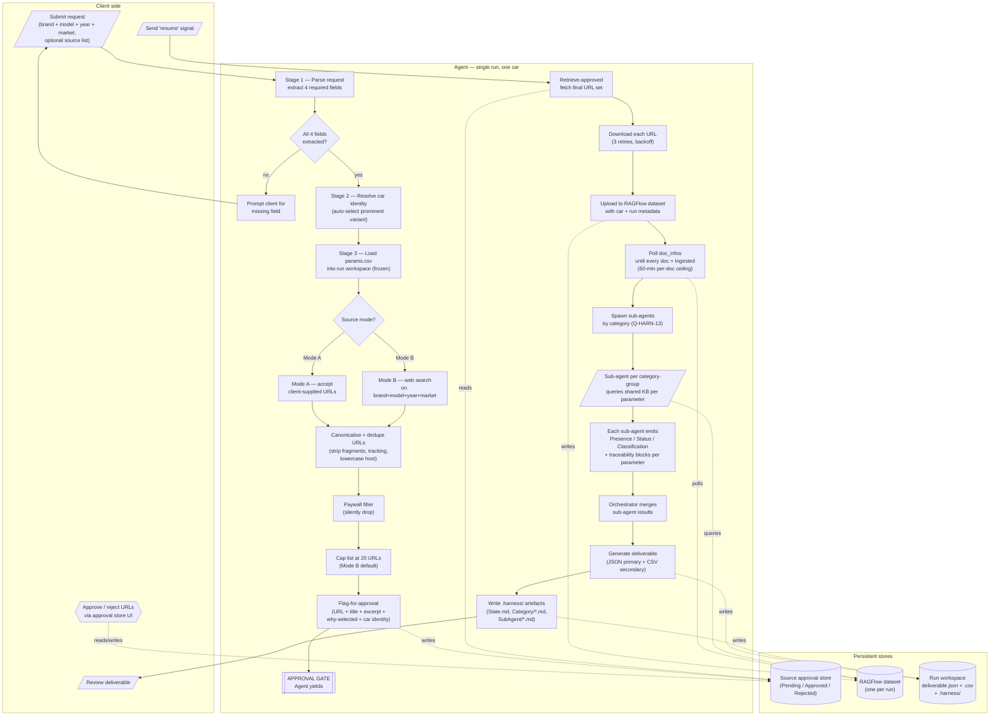
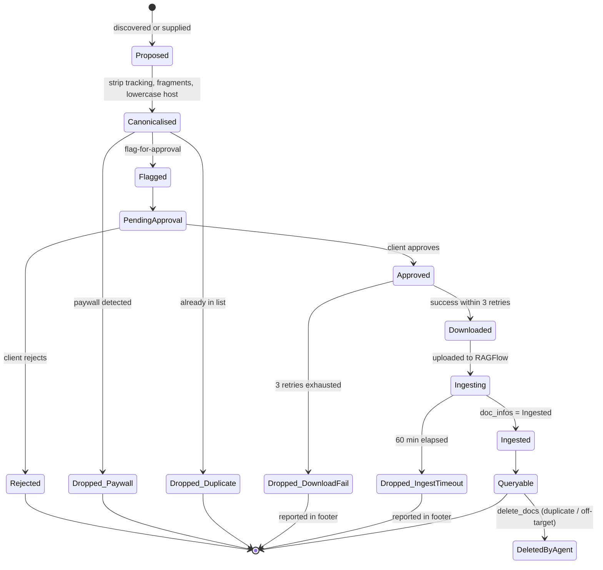
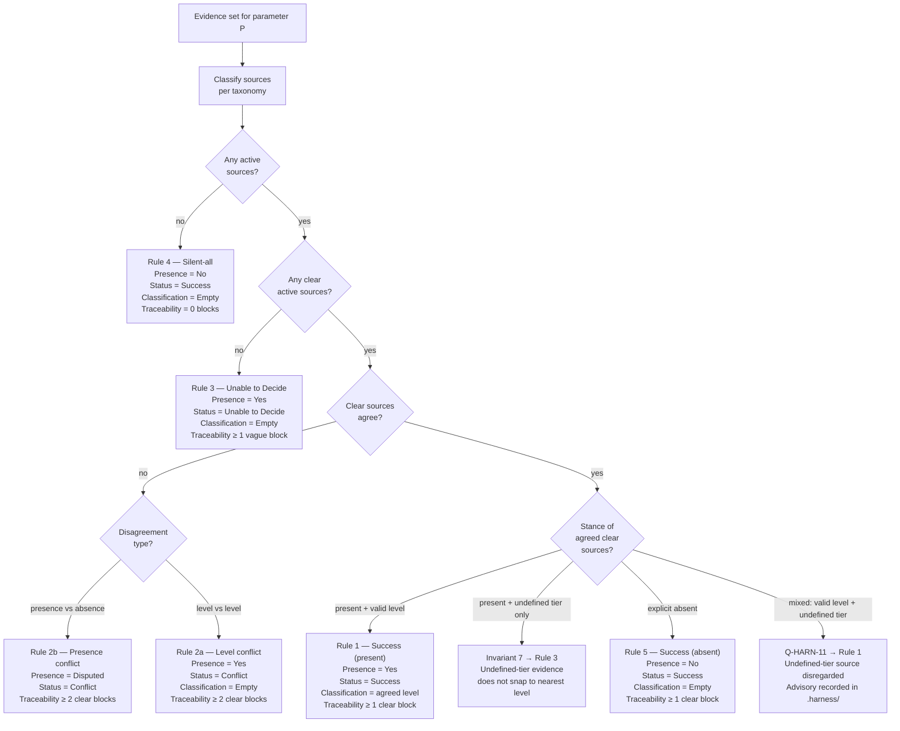
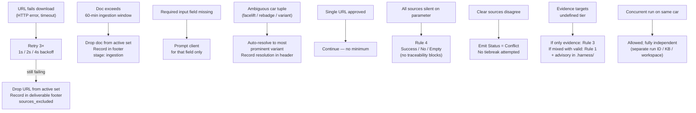

# 12 — Workflow Diagram

End-to-end view of every stage, gate, and actor involved in producing a deliverable for one car. This document is **descriptive** — it consolidates what the other business-logic files already say into a single visual reference. It is the bridge between the business logic (documents 00–11) and the workflow design phase that follows.

> Legend:
> • **Rounded boxes** = agent stages (automated)
> • **Diamonds** = gates / decisions
> • **Parallelograms** = external inputs or outputs
> • **Cylinders** = persistent stores (KB, approval store, workspace)
> • Solid arrows = sequential flow; dashed arrows = asynchronous / decoupled interactions

***

## A. End-to-end master flow (normal pipeline)



***

## B. Source lifecycle per URL



***

## C. Decision-rule branching per parameter (harness interface)



***

## D. Agent / sub-agent topology during classification

```Markdown
flowchart LR
    ORCH["Orchestrator agent<br/>(one per run)"]
    KB[("Shared run KB<br/>(RAGFlow dataset)")]
    SA1["Sub-agent<br/>EV"]
    SA2["Sub-agent<br/>INFOT."]
    SA3["Sub-agent<br/>ADAS-Driving"]
    SA4["Sub-agent<br/>ADAS-Parking"]
    SA5["Sub-agent<br/>Cockpit-Display"]
    SA6["Sub-agent<br/>Cockpit-Audio"]
    SAX["Sub-agent<br/>… (others per category)"]
    STATE[(".harness/State.md<br/>+ Category/*.md<br/>+ SubAgent/*.md")]

    ORCH -- spawn --> SA1
    ORCH -- spawn --> SA2
    ORCH -- spawn --> SA3
    ORCH -- spawn --> SA4
    ORCH -- spawn --> SA5
    ORCH -- spawn --> SA6
    ORCH -- spawn --> SAX

    SA1 -.query.-> KB
    SA2 -.query.-> KB
    SA3 -.query.-> KB
    SA4 -.query.-> KB
    SA5 -.query.-> KB
    SA6 -.query.-> KB
    SAX -.query.-> KB

    SA1 --> STATE
    SA2 --> STATE
    SA3 --> STATE
    SA4 --> STATE
    SA5 --> STATE
    SA6 --> STATE
    SAX --> STATE

    STATE --> ORCH
    ORCH --> DEL["Deliverable<br/>(JSON + CSV)"]
```

***

## E. Hard phase boundary (ARCH-4)

```mermaid
sequenceDiagram
    participant C as Client
    participant A as Agent
    participant S as Approval store
    participant K as KB

    Note over A: PHASE 1 — Source discovery
    C->>A: Submit request
    A->>A: Resolve car identity
    A->>A: Web search (Mode B) or accept URLs (Mode A)
    A->>A: Canonicalise + dedupe + paywall-filter
    A->>S: flag-for-approval (per URL)
    Note over A: Agent yields; web-search tool never used again this run

    Note over C,S: GATE — asynchronous
    C->>S: Approve / reject URLs (may take minutes to days)
    C->>A: "Resume classification" signal

    Note over A: PHASE 2 — Ingestion + classification
    A->>S: retrieve-approved
    S-->>A: Approved URL set (fixed)
    A->>K: download + upload each URL
    A->>K: poll doc_infos
    K-->>A: all Ingested
    A->>A: spawn sub-agents, query KB per parameter
    A->>A: merge + emit deliverable
    A->>C: deliverable.json + deliverable.csv

    Note over A: If client wants more sources post-gate: only option is a new full run (PHASE 1 restart) or separate gap-fill workflow.
```

***

## F. Error-handling overlay



***

## G. Document-cross-reference map

Use this to navigate between the diagram above and the business-logic documents that define each element.

| Element in diagram                          | Authoritative document                            |
| :------------------------------------------ | :------------------------------------------------ |
| Input extraction, four required fields      | `03-inputs.md`, `11-assumptions.md` Q-INPUT-1..8  |
| Car-identity resolution                     | `03-inputs.md`, Q-INPUT-6                         |
| params.csv load + freeze                    | `02-parameters-and-levels.md`, Q-SCOPE-2          |
| Mode A / Mode B source selection            | `04-sources.md`                                   |
| URL canonicalisation                        | `04-sources.md`, Q-SRC-7                          |
| Paywall filter                              | Q-SRC-4                                           |
| Candidate cap                               | Q-SRC-9                                           |
| flag-for-approval metadata                  | Q-SRC-11                                          |
| Approval gate + resume signal               | `04-sources.md`, Q-SRC-6                          |
| Download retries                            | Q-KB-4                                            |
| Ingestion timeout                           | Q-KB-5                                            |
| Fresh dataset per run                       | Q-KB-2                                            |
| Source lifecycle                            | `04-sources.md`, Q-SRC-10 (Retired dropped)       |
| Sub-agent partition                         | Q-HARN-13                                         |
| Decision rules 1 / 2 / 3 / 4 / 5            | `10-decision-rules.md`, `06-harness-interface.md` |
| Presence / Status / Classification contract | `06-harness-interface.md`                         |
| Traceability blocks                         | `09-deliverable.md`                               |
| Deliverable format (JSON + CSV)             | Q-DEL-1                                           |
| Run workspace + .harness/                   | Q-DEL-9                                           |
| Deliverable header + summary                | Q-DEL-5, Q-DEL-6                                  |
| Footer `sources_excluded`                   | Q-DEL-8                                           |
| Re-run patterns                             | Q-DEL-3, Q-DEL-10                                 |
| Gap-fill workflow                           | Q-HARN-5, Q-KB-6, Q-DEL-10                        |
| Concurrent runs                             | Q-SCOPE-3                                         |
| Out-of-list findings                        | Q-SCOPE-5                                         |

